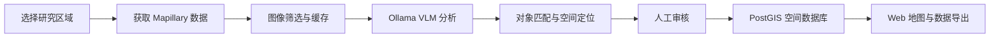

# KI4Geodaten 系统开发规划

## 1. 项目概述

KI4Geodaten 用于获取 Mapillary 街景图像，通过用户提供的 Ollama API 调用视觉语言模型（VLM），识别城市环境中的场景属性和实体对象，并将可重复识别、可可靠定位的结果制作成地图。

主要分析内容：

- 建筑风格、立面材料、屋顶和建筑状态
- 道路、人行道和广场的地面材料
- 交通标志、信号灯、路灯、护栏和路桩
- 垃圾桶、长椅、自行车架、消防栓和充电桩
- 纪念碑、雕塑、喷泉、公共艺术和涂鸦
- 坑洞、损坏设施和无障碍设施
- 无法预先分类的特殊对象

## 2. 系统目标

1. 用户在地图上选择研究区域或上传 GeoJSON。
2. 系统从 Mapillary 获取图像与相机元数据。
3. 系统筛选、抽样并缓存图像。
4. 后台任务调用 Ollama VLM，生成结构化识别结果。
5. 系统区分场景属性、图像观测和可定位实体。
6. 多张图像中的重复对象经过匹配和空间定位。
7. 用户审核、修正、合并或删除识别结果。
8. 审核结果写入 PostGIS，并在 Web 地图中展示和导出。



## 3. 核心概念与范围

### 3.1 场景属性

建筑风格、主要地面材料和街道特征不能直接作为独立地图点，应关联到图像、道路区段、建筑物或空间网格。

### 3.2 图像观测

`observation` 表示某张图像中识别到某个对象。单张图像一般只能证明对象出现在视野中，不能提供对象真实坐标。

### 3.3 空间实体

`entity` 表示经过多图匹配、去重和定位后认为真实存在的唯一对象。没有完成定位的观测只能显示在图像拍摄点，并明确标记为“未定位”。

## 4. 总体架构

### 4.1 推荐技术栈

| 层级 | 推荐技术 | 职责 |
| --- | --- | --- |
| 后端 API | Python 3.12、FastAPI、Pydantic | 项目、任务、审核和导出接口 |
| 空间数据库 | PostgreSQL、PostGIS | 图像、观测、实体和空间分析 |
| 数据访问 | SQLAlchemy、GeoAlchemy2、Alembic | ORM 和数据库迁移 |
| 任务系统 | Celery 或 Dramatiq、Redis | 下载、VLM 推理和定位任务 |
| 文件存储 | MinIO/S3，开发阶段可用本地目录 | 图像、缩略图和原始响应 |
| 前端 | React/Next.js、TypeScript | 任务管理和结果审核 |
| 地图 | MapLibre GL JS，可选 MapillaryJS | 图层展示和街景联动 |
| 部署 | Docker Compose | 本地开发和单机部署 |

初期采用模块化单体，避免过早拆分微服务。建议目录：

```text
backend/
  api/              HTTP 接口
  domain/           核心业务规则
  integrations/     Mapillary 与 Ollama 客户端
  workers/          异步任务
  spatial/          匹配、投影与定位算法
  db/               数据模型与迁移
frontend/           Web 管理和地图界面
tests/              单元、集成和端到端测试
docs/               设计与运行文档
```

Docker Compose 服务：`api`、`worker`、`postgres-postgis`、`redis`、`minio`、`frontend`。

## 5. Mapillary 数据采集

### 5.1 输入

- 地图框选范围或 GeoJSON
- 拍摄时间范围
- 全景/普通图像过滤
- 序列抽帧间隔
- 最低质量要求
- 任务最大图像数量

### 5.2 保存的图像元数据

- `image_id`
- 原始坐标和计算后坐标
- `captured_at`、`sequence_id`
- `compass_angle` 和计算后拍摄方向
- `camera_type`、`camera_parameters`
- `width`、`height`
- 缩略图 URL
- 可用时保存 `quality_score`
- 数据获取时间与原始 API 响应

### 5.3 采集规则

- 大区域拆分成小 BBOX。
- 支持分页、限速、指数退避和断点续传。
- 使用 `image_id` 保证幂等和去重。
- 对连续序列按距离或时间抽帧。
- 图像 URL 可能过期，保留来源 ID 并支持重新获取。
- Token 只通过环境变量或 Secret 管理。
- 地图和导出结果保留 Mapillary 来源标注。

## 6. Ollama VLM 分析

### 6.1 调用约定

- 可配置 Ollama Base URL、鉴权和模型名称。
- 调用 `POST /api/chat`。
- 使用 JSON Schema 约束输出。
- 默认 `temperature=0`，非流式返回。
- 使用 `keep_alive` 降低连续任务的模型加载开销。
- 失败任务有限重试，并记录失败原因。

### 6.2 建议输出结构

```json
{
  "scene": {
    "building_styles": [],
    "facade_materials": [],
    "ground_materials": [],
    "road_material": null,
    "urban_character": null
  },
  "objects": [
    {
      "category": "waste_bin",
      "subtype": null,
      "description": "",
      "bbox_normalized": [0.1, 0.2, 0.3, 0.6],
      "confidence": 0.86,
      "distinctive_features": [],
      "visible_text": null,
      "mapping_candidate": true
    }
  ],
  "unusual_features": []
}
```

### 6.3 可靠性要求

- 使用 Pydantic 校验响应。
- 保存模型名、模型版本、提示词版本和推理参数。
- 同时保存原始响应与解析结果。
- 受控分类词表和自由文本描述同时保留。
- OCR 可作为独立步骤。
- 不允许 VLM 根据外观猜测地址或坐标。
- 模型自报置信度必须通过人工测试集校准。

## 7. 分类体系

| 一级分类 | 示例子类 |
| --- | --- |
| 建筑 | 风格、立面、屋顶、楼层范围、保存状态 |
| 地面 | 沥青、混凝土、石板、鹅卵石、砖、砾石、泥土 |
| 道路设施 | 标志、信号灯、路灯、护栏、路桩 |
| 公共设施 | 垃圾桶、长椅、自行车架、消防栓、充电桩 |
| 城市对象 | 纪念碑、雕塑、喷泉、公共艺术 |
| 环境问题 | 涂鸦、垃圾、坑洞、损坏设施 |
| 无障碍 | 坡道、盲道、通行障碍 |
| 其他 | `other_unusual_object` |

分类体系具有独立版本号。分类变化时创建新版本，不覆盖历史结果。

## 8. 空间定位策略

### A 级：Mapillary 已定位对象

优先使用 Mapillary Map Features。保存外部 Feature ID，避免与自有识别结果重复计数。

### B 级：多视角定位

1. 查找同一序列和邻近序列的相关图像。
2. 在多张图像中获取对象边界框。
3. 根据类别、描述、OCR、时间和空间邻近性匹配观测。
4. 根据相机位置、方向、相机模型和像素位置生成观测射线。
5. 使用至少两条有效射线三角测量。
6. 计算重投影残差、观测数量和定位置信度。
7. 合并空间邻近且特征一致的重复实体。

### C 级：单图近似展示

- 保留为 `observation`。
- 使用图像拍摄点作为展示位置，而不是对象位置。
- 返回 `location_status=unlocated`。
- 不参与设施密度等实体统计。

场景属性按道路区段、建筑 footprint、H3 网格或用户区域聚合，并保留来源图像数、时间范围和不确定性。

## 9. 核心数据模型

| 表 | 说明 |
| --- | --- |
| `projects` | 项目和全局配置 |
| `areas` | 研究区域和空间范围 |
| `mapillary_images` | 图像与相机元数据 |
| `image_assets` | 缓存图像和缩略图 |
| `analysis_jobs` | 后台任务、状态、重试和耗时 |
| `vlm_runs` | 模型、提示词、参数和原始响应 |
| `observations` | 单张图像中的对象识别结果 |
| `entities` | 匹配、去重和定位后的实体 |
| `entity_observations` | 实体与来源观测的关系 |
| `scene_attributes` | 建筑、地面等场景属性 |
| `review_events` | 人工审核和修改历史 |
| `taxonomy_versions` | 分类体系版本 |

数据约定：

- 主键使用 UUID，外部平台 ID 单独保存。
- 时间统一使用 UTC。
- 空间字段以 `EPSG:4326` 保存。
- 距离和三角测量转换到当地投影坐标系。
- 推理和审核采用追加记录，保留审计历史。

## 10. 地图与审核功能

- Mapillary 图像点、拍摄方向和序列
- 已定位实体和未定位观测独立图层
- 建筑风格与地面材料专题图
- 聚类、热力图和时间筛选
- 按类别、模型、置信度和审核状态筛选
- 街景图像与识别框联动
- 查看对象的全部来源图像和推理记录
- GeoJSON、CSV、GeoPackage 导出
- 确认、拒绝、改类、移动、合并和拆分对象
- 记录审核人、时间和修改前后内容

人工确认结果优先于自动推理，不得被后台任务覆盖。

## 11. API 初步设计

```text
POST   /api/projects
GET    /api/projects/{project_id}
POST   /api/projects/{project_id}/areas
POST   /api/areas/{area_id}/imagery-jobs
POST   /api/areas/{area_id}/analysis-jobs
GET    /api/jobs/{job_id}
GET    /api/images
GET    /api/images/{image_id}
GET    /api/observations
PATCH  /api/observations/{observation_id}/review
GET    /api/entities
PATCH  /api/entities/{entity_id}
POST   /api/entities/merge
POST   /api/entities/{entity_id}/split
POST   /api/exports
GET    /api/exports/{export_id}
```

列表接口支持空间范围、类别、时间、置信度、模型版本和审核状态过滤。

## 12. 开发阶段与任务

### Phase 0：项目基础

- [ ] 初始化后端与前端目录
- [ ] 配置 Docker Compose
- [ ] 配置 PostGIS、Redis 和对象存储
- [ ] 建立环境变量模板和 Secret 规则
- [ ] 配置格式检查、静态检查和测试框架
- [ ] 建立 Alembic 数据库迁移
- [ ] 增加健康检查和结构化日志

完成条件：服务可通过单一命令启动；健康检查通过；CI 可执行基础检查和测试。

### Phase 1：技术验证

- [ ] 选定约 `500 m x 500 m` 的测试区域
- [ ] 获取并缓存 100 至 300 张图像
- [ ] 验证 BBOX 拆分、分页、抽帧和去重
- [ ] 配置 Ollama Base URL 和 VLM 模型
- [ ] 确定第一版 JSON Schema 和提示词
- [ ] 测试 10 类实体和 3 类场景属性
- [ ] 记录速度、错误率、显存和并发能力
- [ ] 人工标注样本并评估准确率

完成条件：采集可幂等重跑；至少 95% 的响应可直接或一次重试后通过 Schema；所有结果可追溯；形成评估报告。

### Phase 2：MVP

- [ ] 实现项目与研究区域管理
- [ ] 实现 Mapillary 异步采集
- [ ] 实现图像缓存和任务恢复
- [ ] 实现 Ollama 异步分析
- [ ] 建立核心 PostGIS 数据模型
- [ ] 展示图像、场景属性和观测结果
- [ ] 实现基础人工审核
- [ ] 实现 GeoJSON 和 CSV 导出
- [ ] 区分已定位和未定位状态

完成条件：用户可以完成一次完整分析；失败任务可重试；未定位对象不显示为真实坐标；人工结果不被覆盖。

### Phase 3：实体匹配与定位

- [ ] 评估 VLM 边界框质量
- [ ] 实现邻近候选图像搜索
- [ ] 实现跨图像观测匹配
- [ ] 实现相机射线和三角测量
- [ ] 计算重投影残差和定位质量
- [ ] 实现实体去重、合并和拆分
- [ ] 与 Mapillary Map Features 对照验证

完成条件：每个已定位实体至少关联两个有效观测；结果包含定位方法、观测数、误差和置信度；在测试集上报告匹配准确率和位置误差。

### Phase 4：规模化

- [ ] 实现空间瓦片化和增量采集
- [ ] 增加任务优先级、并发限制和资源配额
- [ ] 优化 GPU 批处理与模型常驻时间
- [ ] 增加模型与提示词对比评估
- [ ] 实现监控、告警、备份和恢复
- [ ] 增加用户、角色和项目权限
- [ ] 制定数据保留和清理策略

完成条件：大任务可暂停、恢复和增量更新；可监控吞吐、错误率和资源消耗；备份恢复流程经过验证。

## 13. 测试与评测

### 自动化测试

- Mapillary 和 Ollama 客户端使用模拟响应测试。
- 使用临时 PostGIS 进行集成测试。
- 测试任务重试、幂等、限速和错误响应。
- 使用固定响应测试 Schema 解析。
- 使用合成数据测试坐标转换、射线和三角测量。
- 端到端测试覆盖区域创建、分析、审核和导出。

### 人工评测集

至少建立 100 张标注图像，记录对象类别、边界框、场景属性、跨图像实体关联、可获得的真实坐标以及遮挡和模糊等质量标签。

评测指标：

- 分类 precision、recall、F1
- 边界框 IoU
- 跨图像匹配 precision、recall
- 定位误差中位数和 95 分位数
- 每张图推理时间和失败率
- 每平方公里处理量与成本

## 14. 安全、合规和可追溯性

- Mapillary 与 Ollama 凭据不得提交到 Git。
- 不长期保存不必要的高分辨率图像。
- 保留 Mapillary 数据来源和许可要求的署名。
- 不开发身份、人脸或车牌识别功能。
- 日志不记录 Token 或完整图片 base64。
- 导出数据包含来源、采集时间、模型版本和审核状态。
- 人工修改和实体合并必须可审计。

## 15. 主要风险

| 风险 | 应对措施 |
| --- | --- |
| Mapillary API 限制或临时错误 | 小 BBOX、限速、退避、缓存和断点续传 |
| 图像覆盖不足或时间过旧 | 展示覆盖度和拍摄时间，允许补充数据源 |
| VLM 分类不稳定 | 受控词表、Schema、版本管理和人工审核 |
| VLM 边界框不准确 | 单独评测，必要时增加专用检测模型 |
| 单图结果被当作真实坐标 | 严格区分 observation 与 entity |
| 多图对象错误匹配 | 时空约束、视觉特征、残差阈值和复核 |
| GPU 吞吐不足 | 抽帧、缓存、队列、批处理和配额 |
| 分类体系变化 | taxonomy 和 prompt 独立版本化 |

## 16. MVP 验收标准

- [ ] 同一采集任务重复执行不会产生重复图像。
- [ ] 所有 VLM 输出经过 Schema 校验。
- [ ] 结果可追溯到图像、模型、提示词和运行时间。
- [ ] UI 清楚区分图像位置、未定位观测和已定位实体。
- [ ] 人工审核结果不会被自动任务覆盖。
- [ ] 支持按类别、置信度、时间和审核状态筛选。
- [ ] 支持导出带来源信息的 GeoJSON 和 CSV。
- [ ] 建立至少 100 张图像的人工评测集。
- [ ] 关键 API、采集和审核流程具有自动化测试。

## 17. 开发前待确认项

- Ollama Base URL、鉴权方式和网络位置
- VLM 模型名称、显存和并发能力
- 第一个测试区域
- Mapillary Access Token
- 是否允许长期缓存图像
- 首批必须支持的对象类别
- 是否叠加 OpenStreetMap 建筑和道路数据
- 部署目标是本机、局域网服务器还是云服务器

## 18. 实施优先级

1. 稳定、可恢复、可重复的 Mapillary 采集。
2. 可验证和可追溯的 VLM 结构化输出。
3. 清楚区分 `observation`、`entity` 和场景属性。
4. 完成人工审核与基础地图闭环。
5. 经过评测后再开发多视角定位。

MVP 不把未经验证的单图推测坐标作为真实对象位置。
